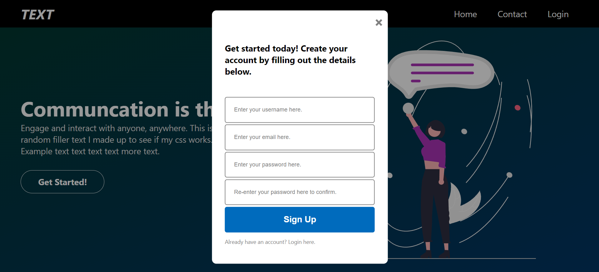
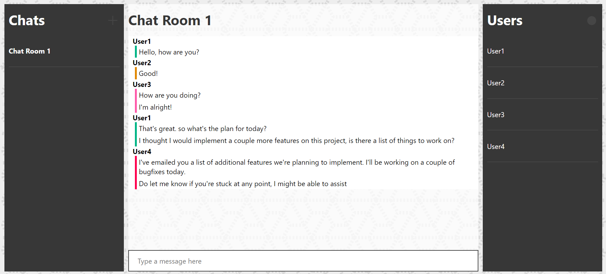
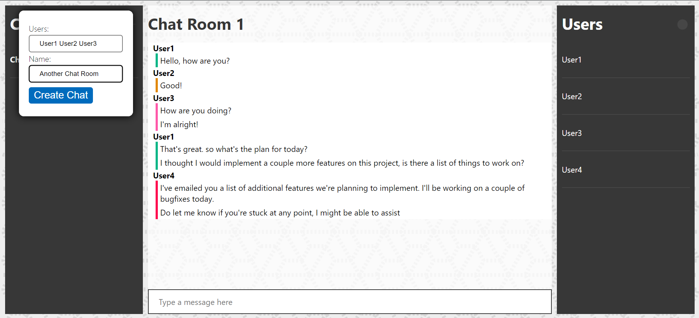
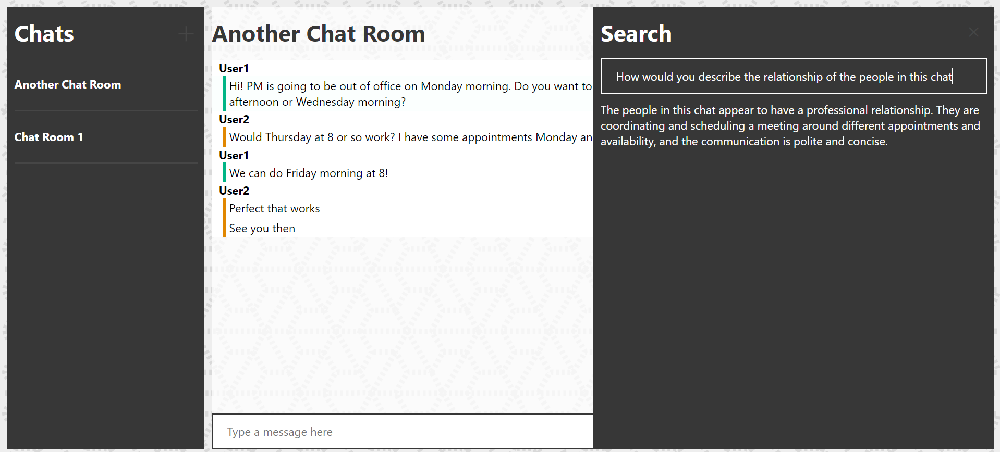
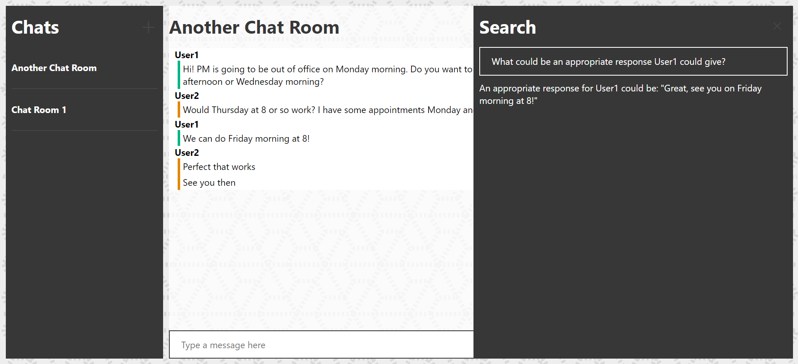

# Chat App

A simple instant messaging application.

## Table of Contents

- [Introduction](#introduction)
- [Features](#features)
- [Setup](#setup)
- [Usage](#usage)
- [Examples](#examples)

## Introduction

This project is a concept of a simple instant messaging application that is built on the MEAN Stack and is integrated with the OpenAI API to analyze and query any chat log with natural language. This integration enables users to easily search through, summarize, query, and analyze their chat logs with other users using natural language with ease.

## Features

- Responsive and intuitive modern user interface
- Robust authentication system based on JWTs
- Session handling
- Ability to create and invite other users to different chat rooms
- Switch instantly between chat rooms
- View all users in a chat room
- Realtime message delivery using WebSockets
- Unique colors for each user in a chat room
- Ability to delete messages and chat rooms
- Chat logs from each room are embedded and stored in a vectorstore
- Ability to query the chat using natural language using langchain and openai completion models with the vectorstore as context

## Setup

1. Clone the repository:
   ```sh
   git clone https://github.com/RSYashwanth/Chat-Application.git
   ```
2. Set OpenAI API key:
   ```sh
   vim .env.example # Follow instructions inside file
   ```
2. Run docker-compose
   ```sh
   docker-compose up
   ```
3. Open localhost on any browser of choice

## Usage

### Creating a user

1. On the welcome page, click on the `Get Started` button
2. Select the `sign up here` text at the bottom of the popup to create a profile
3. Enter a username, email, password and password confirmation to sign up
4. Repeat these steps with unique usernames to create multiple accounts

### Creating a chat room

1. On the home screen, click the `+` button besides the `Chat` pane
2. In the popup, enter a list of space-seperated valid usernames to include all the users in the chat room
3. Enter a name for the name of the chat
4. Click the `Create Chat` button

### Messaging

1. Type a message in the chat box and click enter to send it to other users in the chat
2. To delete a message, click on the `...` to the right of any hovered message and click delete
3. To delete a chat room, Click the `x` next to the chat's name

### Searching

1. To search through a particular chat room, first enter a chat room
2. Press the circular button on the top-right corner besides the `Users` pane
3. Type in a query and wait for the model to analyze and respond. (Don't forget to set you API key in the .env file)

## Examples
1. 
2. 
3. 
4. 
5. 

For more screenshots, look into /images
   
